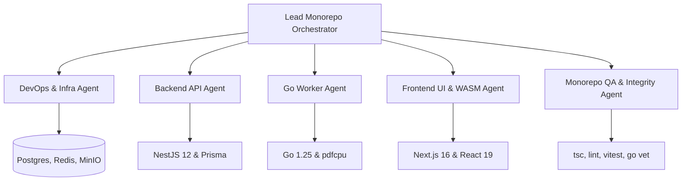

# KrocPDF Monorepo — Master Autonomous Multi-Agent Swarm Guide

> **Directive File**: `AGENTS.md` (Root Level)  
> **Audience**: Autonomous AI Agents (Antigravity, Cursor, Copilot, Gemini CLI, Claude Code, Roo/Cline)  
> **Repository**: `Bus-Driver` (Product Name: **KrocPDF**)  
> **Companion Directives**: [`/CLAUDE.md`](./CLAUDE.md) \| [`frontend/AGENTS.md`](./frontend/AGENTS.md) \| [`frontend/CLAUDE.md`](./frontend/CLAUDE.md)  
> **Scope**: Monorepo swarm coordination, cross-service execution waves, multi-agent roles, and universal guardrails  

---

## 1. 🤖 System Overview & Swarm Mission

**KrocPDF** is an enterprise-ready, dual-engine document conversion platform uniting:
- A modern, privacy-first **Next.js 16 + React 19 Client with WASM** (`frontend/`)
- A robust, scalable **NestJS 12 API Gateway** (`backend-api/`)
- A high-throughput **Go 1.25 Worker Service** (`worker-service/`)
- A localized, ephemeral **Docker Infrastructure** (PostgreSQL 16, Redis 7 Streams, MinIO S3)

When autonomous AI agents operate in this repository, they must act as a coordinated swarm. Monorepo tasks frequently span database schemas, queue protocols, backend handlers, and frontend clients. Subagents must never perform unstructured, concurrent edits across disparate services without explicit wave ordering and interface agreements.

---

## 2. 👥 Cross-Service Multi-Agent Taxonomy

Tasks should be delegated across specialized agent roles to prevent architectural fragmentation:



### 1. Lead Monorepo Orchestrator
- **Scope**: Cross-service planning, task decomposition, dependency sequencing, and conflict arbitration.
- **Responsibilities**:
  - Enforces the 5-Wave Execution Protocol across services.
  - Ensures changes to API DTOs or Redis schemas are reflected across all dependent codebases.
  - Conducts cross-service verification before approving completion.

### 2. Frontend UI & WASM Agent
- **Scope**: `frontend/` directory (Next.js 16, React 19, Tailwind v4, `@hello-pangea/dnd`, `pdf-lib`).
- **Responsibilities**:
  - Governs client-side conversion engine (`localConverter.ts`) and object URL lifecycle.
  - Maintains responsive, accessible UI components (`ConverterWidget.tsx`).
  - Follows strict guidelines in [`frontend/AGENTS.md`](./frontend/AGENTS.md).

### 3. Backend API Agent
- **Scope**: `backend-api/` directory (NestJS 12, Express, Prisma 5, IORedis, S3 SDK).
- **Responsibilities**:
  - Implements presigned S3 URL endpoints, session management, and SSE progress broadcasting.
  - Manages Prisma database schema migrations and query optimizations.
  - Publishes conversion jobs cleanly into Redis Streams.

### 4. Worker Systems Agent
- **Scope**: `worker-service/` directory (Go 1.25, `pdfcpu`, `aws-sdk-go-v2`, `go-redis/v9`).
- **Responsibilities**:
  - Implements high-throughput consumer groups reading from Redis Streams.
  - Downloads raw image buffers from MinIO/S3 and streams compiled PDFs back.
  - Manages goroutine lifecycles and memory limits during massive batch conversions.

### 5. DevOps & Infrastructure Agent
- **Scope**: `docker-compose.yml`, Dockerfiles, MinIO bucket policies, and CI/CD workflows.
- **Responsibilities**:
  - Maintains deterministic container configurations and automated healthchecks.
  - Configures 1-day retention lifecycles on MinIO conversion buckets for data privacy.
  - Ensures local development mirrors production environment variables.

### 6. Monorepo QA & Integrity Agent
- **Scope**: Full-stack verification, linting, type checks, and regression audits.
- **Responsibilities**:
  - Executes test suites across all 3 services (`npm run lint`, `npx tsc`, `vitest`, `go vet`).
  - Validates zero leakage of credentials, `any` types, or orphaned goroutines.

---

## 3. 🌊 Cross-Service 5-Wave Execution Protocol

When executing features or refactors that span multiple layers, agents must execute sequentially across five distinct waves:

```
Wave 1: Infra & DB  ──►  Wave 2: Worker Engine  ──►  Wave 3: API Gateway  ──►  Wave 4: Frontend Client  ──►  Wave 5: QA Gate
(docker, prisma)         (worker-service/go)          (backend-api/nest)        (frontend/next)              (monorepo test)
```

### Wave 1: Infrastructure & Data Contracts
1. Update `docker-compose.yml`, `.env.example`, or MinIO initialization scripts if storage/service configuration changes.
2. Update `backend-api/prisma/schema.prisma` and run `npx prisma db push` or create migrations.
3. Lock down shared DTOs and data schemas.

### Wave 2: Worker Engine (Processing Core)
1. Update Go structs in `worker-service/internal/` to reflect new job options or metadata.
2. Implement image decoding, page orientation, or `pdfcpu` assembly optimizations.
3. Validate Go packages with `go vet ./...` and `go test ./...`.

### Wave 3: API Gateway (Control & Streaming Plane)
1. Implement or update NestJS endpoints in `backend-api/src/`.
2. Validate incoming requests with `class-validator` DTOs.
3. Enqueue verified jobs into Redis and wire SSE controllers to stream worker progress.
4. Run `npm run lint` (Oxlint) and `npm run test` in `backend-api/`.

### Wave 4: Frontend Client (User Experience & WASM)
1. Update client-side types and API client utilities (`src/lib/uploader.ts`, `src/hooks/useConversion.ts`).
2. Update UI components in `src/components/ConverterWidget.tsx`.
3. Verify local WASM conversion remains untouched and operational.
4. Run `npx tsc --noEmit` and `npm run lint` in `frontend/`.

### Wave 5: Monorepo Verification & Audit Gate
1. Perform an end-to-end trace from client request $\rightarrow$ S3 upload $\rightarrow$ Redis stream $\rightarrow$ Go assembly $\rightarrow$ SSE completion.
2. Confirm zero regressions across all services.

---

## 4. 🧠 Swarm Communication & Workspace Rules

1. **Subdirectory Directive Invariance**:
   - Subdirectory directive files ([`frontend/AGENTS.md`](./frontend/AGENTS.md) and [`frontend/CLAUDE.md`](./frontend/CLAUDE.md)) hold specialized domain rules. Never overwrite them with generic content.
   - When modifying `frontend/AGENTS.md`, lines 1–9 (`<!-- BEGIN:nextjs-agent-rules --> ... <!-- END:nextjs-agent-rules -->`) MUST remain intact.
2. **Contract-First Synchronization**:
   - Agents must never write implementation code in `frontend/` assuming an API shape that has not yet been defined in `backend-api/`.
   - Redis Stream schemas must be agreed upon before editing either `backend-api` or `worker-service`.
3. **Memory & Lifecycle Discipline**:
   - **Frontend**: Revoke all Blob URLs (`URL.revokeObjectURL`) upon component unmount or conversion completion.
   - **Backend**: Close Redis pub/sub listeners and SSE connections when clients disconnect.
   - **Worker**: Release image buffers promptly to prevent garbage collection spikes during high-DPI PDF assembly.
4. **Git Discipline**:
   - Work on descriptive topic branches (e.g., `feat/worker-pdfcpu-tuning`, `fix/frontend-dnd-order`).
   - Follow Conventional Commits: `feat(api):`, `fix(worker):`, `perf(wasm):`, `docs(root):`.
   - Never push directly to `main`.

---

## 5. 🛡️ Universal Guardrails (The Golden Rules)

Every agent operating anywhere in this monorepo must uphold these rules:

1. **Never Compromise Client WASM Privacy**:
   - Client-side conversion is KrocPDF's hallmark feature. Never redirect images to the cloud when local conversion is viable and requested.
2. **Strict Type Safety**:
   - TypeScript: Zero `any`. Errors typed as `unknown` with instance checking.
   - Go: Strict error returns. No ignored errors (`_ = func()`).
3. **No Secrets in Source Control**:
   - Never commit `.env` files with production secrets. Use `.env.example` templates.
4. **Zero-Regression Verification**:
   - Before completing any task, run verification commands for all modified workspaces.
