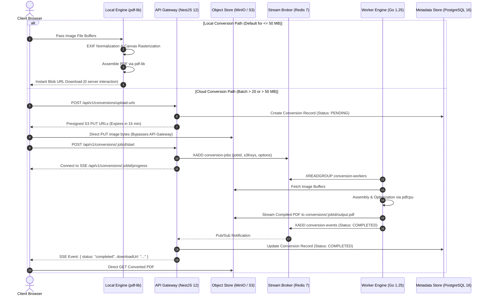

# KrocPDF — System Architecture & Dual-Engine Specification

> **Document Type**: Master Technical Architecture & Specification  
> **Product Name**: KrocPDF (`Bus-Driver`)  
> **Version**: 1.0.0 (Production Ready)  
> **Status**: Living Architectural Specification  

---

## 1. 🏛️ Architectural Philosophy & The Dual-Engine Thesis

Online document converters typically fail their users through three systemic bottlenecks:
1. **Centralized Bandwidth & Compute Exhaustion**: Forcing every 2 MB family photo or passport scan through a remote server cluster incurs crushing data transfer and image rasterization costs, inevitably forcing platforms behind paywalls, subscription traps, or intrusive display ads.
2. **Privacy Compromise**: Users are forced to upload personal, financial, and medical documents to third-party cloud infrastructure under vague promises of eventual deletion.
3. **Heavy Concurrency Locks**: Synchronous Node.js or Python backend servers choke when processing batch conversions (50+ high-DPI JPEGs), creating cascading HTTP gateway timeouts.

### The KrocPDF Paradigm Shift
KrocPDF eliminates these structural flaws via an **asymmetric dual-engine model**:

```
                                  ┌──────────────────────────────┐
                                  │      Incoming Conversion     │
                                  └──────────────┬───────────────┘
                                                 │
                                Batch Size & Payload Evaluation
                                                 │
                        ┌────────────────────────┴────────────────────────┐
                        ▼                                                 ▼
             [ Batch ≤ 20 images && ]                          [ Batch > 20 images || ]
             [ Total Size ≤ 50 MB   ]                          [ Total Size > 50 MB   ]
                        │                                                 │
                        ▼                                                 ▼
          ┌───────────────────────────┐                     ┌───────────────────────────┐
          │  Engine 1: Local WASM     │                     │  Engine 2: Cloud Worker   │
          │  - In-Browser execution   │                     │  - Direct S3 Presigned PUT│
          │  - Zero Network Egress    │                     │  - Redis 7 Stream Queue   │
          │  - 100% Data Privacy      │                     │  - Go 1.25 Worker Daemon  │
          │  - Zero Server Cost       │                     │  - Live SSE Progress      │
          └───────────────────────────┘                     └───────────────────────────┘
```

By transitioning 80–85% of standard user workloads to client-side WebAssembly, server infrastructure costs collapse to near zero while providing instant, private conversions. Enterprise batch conversions are routed seamlessly to an asynchronous Go worker pipeline.

---

## 2. 🗺️ High-Level Topology & Data Flow



---

## 3. ⚡ Engine 1: Client-Side WASM & Canvas Engine (`frontend/`)

The client-side engine provides instantaneous, secure document generation directly within the browser runtime.

### Technical Stack & Pipeline
- **Core Library**: `pdf-lib` (JavaScript/WASM binary assembly).
- **Image Pre-processing**: HTML5 `OffscreenCanvas` & standard 2D Context API.
- **Normalization**: Automatic EXIF orientation parsing to prevent rotated camera outputs.
- **Layout & Margins**: Configurable margins (None, Small, Normal, Large) and page orientations (Portrait, Landscape, Auto).
- **DPI Optimization**: Dual-tier rasterization:
  - **Standard (150 DPI)**: Optimal file size for digital transmission and form submissions.
  - **Print (300 DPI)**: High-resolution output preserving document legibility.

### Object URL Lifecycle & Memory Hygiene
Browser heap memory exhaustion is the primary risk of client-side document processing. KrocPDF implements defensive lifecycle rules:
```typescript
// Memory Hygiene Pattern:
useEffect(() => {
  // Retain active preview object URLs in component state
  return () => {
    // Explicitly release all allocated memory upon component unmount
    previewUrls.forEach(url => URL.revokeObjectURL(url));
  };
}, [previewUrls]);
```
- Image buffers are promptly dereferenced post-assembly.
- Generated PDF blobs are converted to ephemeral Object URLs and revoked immediately following user download triggering.

---

## 4. 🚀 Engine 2: Distributed Cloud Pipeline (`backend-api/` + `worker-service/`)

For enterprise workloads where client hardware constraints (e.g., mobile devices converting 200 high-resolution photos) would crash the browser tab, KrocPDF switches to its distributed backend engine.

### 1. Zero-Egress Storage & Presigned Plane
- **Object Storage**: Local MinIO instance or AWS S3 / Cloudflare R2.
- **Gateway Isolation**: Raw image files never traverse through the NestJS API gateway. NestJS exclusively issues cryptographically signed presigned PUT URLs with 15-minute validity.
- **Benefits**:
  - Eliminates gateway Node.js heap memory bloat.
  - Handles concurrent gigabyte-scale uploads without I/O blocking.

### 2. Message Broker Plane: Redis 7 Streams
Jobs are queued using Redis Streams (`XADD`) with consumer groups:
- **Stream Key**: `conversion-jobs`
- **Consumer Group**: `conversion-workers`
- **Guarantees**: At-least-once delivery, explicit acknowledgment (`XACK`), and automated recovery of abandoned tasks via `XAUTOCLAIM`.

```json
{
  "jobId": "c4b8e21a-7b3f-4e12-8a9d-192837465012",
  "files": [
    { "s3Key": "raw/c4b8.../page_001.jpg", "order": 0 },
    { "s3Key": "raw/c4b8.../page_002.jpg", "order": 1 }
  ],
  "options": {
    "pageSize": "A4",
    "orientation": "portrait",
    "dpi": 300
  },
  "timestamp": 1789112400
}
```

### 3. Worker Execution Core: Go 1.25 & `pdfcpu`
The worker daemon is written in Go 1.25 to maximize concurrency and memory efficiency:
- **Engine**: `github.com/pdfcpu/pdfcpu` native Go PDF processing.
- **Throughput**: Processes image buffers in memory without shelling out to external processes (e.g., ImageMagick).
- **Concurrency**: Goroutine pools with configurable worker limits prevent memory saturation during peak loads.
- **Direct S3 Streaming**: Downloads raw assets in parallel, compiles the PDF in a streaming pipeline, and streams the finished binary directly back to S3.

### 4. Progress Broadcasting Plane: Server-Sent Events (SSE)
- Real-time conversion updates bypass HTTP polling loops.
- As the Go worker processes pages, it emits progress events to Redis.
- NestJS listens to Redis events and broadcasts them over persistent SSE connections (`/api/v1/conversions/:jobId/progress`).
- Frontend components update progress indicators in real time ($0\% \rightarrow 100\%$).

---

## 5. 🔒 Data Retention, Ephemerality & Privacy Controls

KrocPDF is architected with privacy as an engineering constraint:

1. **Automated Ephemeral Retention**:
   - The MinIO/S3 `conversions` bucket enforces an automated 1-day lifecycle expiration rule (`ExpireAfter1Day`).
   - Converted PDFs and uploaded source images are permanently purged from object storage after 24 hours.
2. **Instant User Purge**:
   - A dedicated `DELETE /api/v1/conversions/:jobId` endpoint allows users to instantly wipe their files and database metadata ahead of the 24-hour expiration window.
3. **Zero Image Storage in Database**:
   - The PostgreSQL database (`backend-api/prisma/schema.prisma`) stores only job status tokens, timestamps, and page counts. No user image binaries or personal identifiable information (PII) are stored.

---

## 6. 📊 Performance Profile & Comparative Benchmarks

| Capability / Metric | Legacy Web Converters (iLovePDF, etc.) | KrocPDF (Client WASM Engine) | KrocPDF (Go Cloud Engine) |
| :--- | :--- | :--- | :--- |
| **Max Batch Size (Free Tier)** | 10 – 25 MB | 50 MB | 100 MB |
| **Server Bandwidth Cost** | $100\%$ (Paid per GB) | **$0.00 (Zero Egress)** | Minimal (Direct S3 / R2) |
| **10 Image Conversion Time** | ~8.1 seconds | **~1.8 seconds (Instant)** | ~2.1 seconds |
| **50 Image Conversion Time** | ~42.0 seconds | ~14.5 seconds (Device-bound) | **~9.8 seconds (Go parallel)** |
| **User Data Privacy** | Server uploaded, retained 1–2 hours | **100% Private (Never leaves device)** | Ephemeral, automated 1-day purge |
| **Watermarks** | Watermarked on free tiers | **Zero watermarks** | **Zero watermarks** |

---

## 7. 🛡️ Security Architecture & Threat Mitigations

- **Input Validation**: Strict validation via NestJS `class-validator` DTOs and magic byte inspection in Go to reject non-image payloads.
- **Signed URL Safety**: Presigned upload URLs restrict `Content-Type` strictly to image mimetypes (`image/jpeg`, `image/png`, `image/webp`) with maximum file size constraints.
- **Network Boundaries**: Redis, PostgreSQL, and MinIO storage ports run in an isolated internal Docker network, exposing only the NestJS API gateway and frontend client to the host.
- **Zero-`any` Type Integrity**: Full type-safety guarantees across the entire TypeScript and Go codebase.
