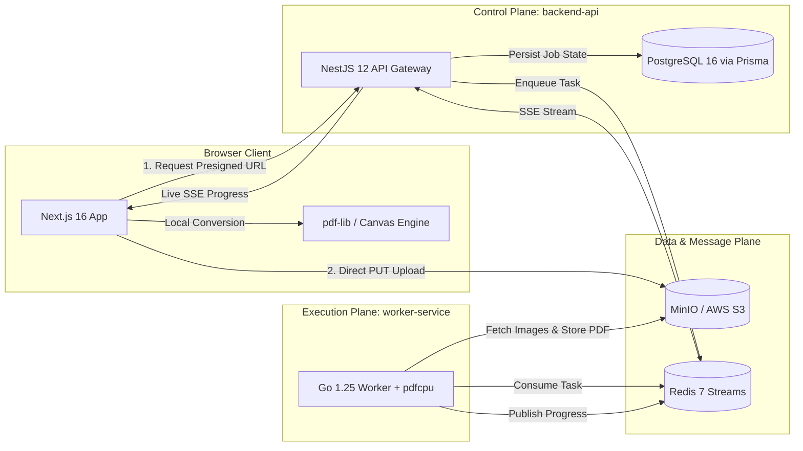

# KrocPDF Monorepo — Master Claude Code System Guide

> **Directive File**: `CLAUDE.md` (Root Level)  
> **Audience**: Anthropic Claude Code & Autonomous AI Assistants operating across the entire repository  
> **Repository**: `Bus-Driver` (Product Name: **KrocPDF**)  
> **Scope**: Monorepo architectural context, cross-service contracts, build/test commands, and universal invariants  

---

## 1. 🏗️ Project Overview & Architecture

**KrocPDF** is a privacy-first, high-throughput JPG-to-PDF conversion platform built as a hybrid dual-engine system:
1. **Client-Side WASM Engine (`frontend/`)**: Instant client-side conversion for payloads under 50 MB with zero network transmission, maximum privacy, and client-side canvas rendering.
2. **Distributed Cloud Pipeline (`backend-api/` + `worker-service/`)**: Asynchronous, distributed processing for massive multi-gigabyte or multi-thousand image batches with presigned S3 uploads, Redis queueing, and Go workers.



---

## 2. 🗂️ Monorepo Structure & Tech Stack

| Directory | Service / Role | Primary Technologies | Key Responsibilities |
| :--- | :--- | :--- | :--- |
| [`frontend/`](./frontend) | Web Client & WASM Engine | Next.js 16 (App Router), React 19, Tailwind v4, `@hello-pangea/dnd`, `pdf-lib` | UI/UX, instant local PDF conversion, upload orchestration, SSE progress monitoring |
| [`backend-api/`](./backend-api) | API Gateway & Orchestrator | NestJS 12, Express, Prisma 5, IORedis, `@aws-sdk/client-s3`, Oxlint, Vitest | Presigned URL generation, auth/session control, job state tracking, SSE event streaming |
| [`worker-service/`](./worker-service) | High-Performance Worker | Go 1.25, `pdfcpu`, `aws-sdk-go-v2`, `go-redis/v9` | Redis stream task consumption, high-throughput image download, PDF assembly & optimization |
| [`docs/`](./docs) | Documentation & Assets | Markdown, Architecture Specs, Brand Assets | System design diagrams, API contracts, logos, guides |
| [`docker-compose.yml`](./docker-compose.yml) | Local Infrastructure | PostgreSQL 16, Redis 7 (AOF), MinIO (S3 compatible) + MinIO init container | Zero-setup local service orchestration with 1-day auto-lifecycle bucket policies |

---

## 3. ⚡ Developer Cheat Sheet & Service Commands

Always navigate to the respective directory or execute commands within their intended workspace:

### Infrastructure (Docker)
```bash
# Start all dependencies (Postgres, Redis, MinIO with automated bucket setup)
docker-compose up -d

# Check health and container statuses
docker-compose ps

# Tear down infrastructure
docker-compose down
```

### Frontend (`frontend/`)
```bash
cd frontend
npm install
npm run dev           # Starts Next.js dev server on http://localhost:3000
npm run lint          # Runs ESLint (Must exit 0)
npx tsc --noEmit      # Runs TypeScript compiler checks (Must exit 0)
npm run build         # Production Next.js build
```

### Backend API (`backend-api/`)
```bash
cd backend-api
npm install
npm run start:dev     # Starts NestJS with hot reload on http://localhost:8000
npm run lint          # Runs Oxlint over src/ and test/
npm run test          # Runs Vitest unit tests
npm run test:e2e      # Runs Vitest end-to-end test suite
npx prisma generate   # Generates Prisma client
npx prisma db push    # Syncs schema to PostgreSQL
```

### Worker Service (`worker-service/`)
```bash
cd worker-service
go run ./cmd/...      # Runs the Go worker process
go test ./...         # Runs Go unit tests
go vet ./...          # Runs Go static code analysis
```

---

## 4. 🔄 Cross-Service Communication Contracts

### A. Presigned S3 Upload Contract
1. **Request**: Frontend requests upload authorization via `POST /api/v1/conversions/upload-urls`.
2. **Response**: Backend provides presigned S3 PUT URLs with strict content-type (`image/jpeg`, `image/png`) and short expiration ($15$ minutes).
3. **Execution**: Frontend uploads files directly to MinIO/S3 bypassing the NestJS API gateway to eliminate server memory bottlenecks.

### B. Redis Stream Job Schema
Jobs pushed to Redis Stream `conversion-jobs`:
```json
{
  "jobId": "uuid-v4",
  "userId": "optional-uuid",
  "files": [
    { "s3Key": "raw/jobId/001.jpg", "order": 0 },
    { "s3Key": "raw/jobId/002.jpg", "order": 1 }
  ],
  "options": {
    "pageSize": "A4",
    "orientation": "portrait",
    "quality": 85,
    "dpi": 300
  },
  "createdAt": "2026-09-11T12:00:00Z"
}
```

### C. Server-Sent Events (SSE) Progress Contract
Frontend listens to `GET /api/v1/conversions/:jobId/progress` via SSE:
- `event: queued` $\rightarrow$ `{ "status": "queued", "position": 2 }`
- `event: progress` $\rightarrow$ `{ "status": "processing", "progress": 45, "page": 9, "totalPages": 20 }`
- `event: completed` $\rightarrow$ `{ "status": "completed", "downloadUrl": "https://...", "fileSize": 10485760 }`
- `event: failed` $\rightarrow$ `{ "status": "failed", "error": "Invalid JPEG image header" }`

---

## 5. 🛡️ Universal Guardrails & Monorepo Invariants

1. **Dual-Engine Integrity**:
   - Never disable or remove client-side WASM conversion (`pdf-lib`) in `frontend/`. Small payloads must always enjoy zero-cloud local conversion.
2. **Strict TypeScript & Go Standards**:
   - **TypeScript**: Zero tolerance for `any` types. All API responses, DTOs, and component props must have explicit types. Catch blocks must type err as `unknown`.
   - **Go**: Idiomatic error propagation with `fmt.Errorf("context: %w", err)`. Explicit goroutine lifecycle management (no detached worker leaks).
3. **Storage Lifecycle & Privacy**:
   - Direct MinIO/S3 uploads must respect the automated 1-day retention lifecycle. Never store sensitive converted files indefinitely.
4. **Subdirectory Directive Preservation**:
   - Respect `frontend/CLAUDE.md` and `frontend/AGENTS.md`. When working inside `frontend/`, preserve lines 1–9 of `frontend/AGENTS.md` injected by Next.js.
5. **Git Discipline**:
   - Never commit directly to `main`.
   - Always verify affected services before opening PRs (`npx tsc --noEmit`, `npm run lint`, `go vet ./...`).
