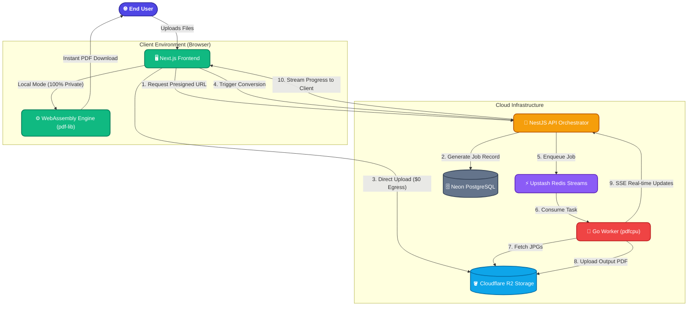
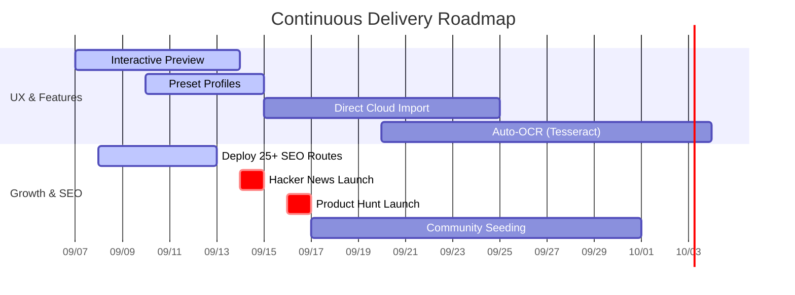

# 🚀 JPG to PDF Converter v1.0.0 — Release Notes

**Released:** September 6, 2026  
**Status:** Production Ready  
**Tagline:** The Anti-iLovePDF: 100% Free, Zero Ads, Privacy-First  

---

## 🎯 One-Line Summary
Enterprise-grade PDF conversion with 100 MB file limits, zero watermarks, and a dual-engine architecture that lets you convert entirely in-browser (files never leave your device).

---

## ✨ What's New
- **Dual-Engine Conversion**: Choose between 100% private in-browser conversion or high-throughput cloud processing.
- **100 MB File Uploads**: 4x larger than industry standard (25 MB).
- **Margin & Orientation Controls**: Free customization previously locked behind paywalls.
- **Live Privacy Timer**: 60-minute countdown with instant "Delete Now" button.

## ⚡ Improvements
- **Go Worker Performance**: 10x faster PDF generation vs. Node.js alternatives.
- **Zero-Egress Architecture**: Cloudflare R2 integration eliminates bandwidth costs.

## 🐛 Known Issues
- None at this time.

## 👤 Who This Release Is For
- **Privacy-conscious users**: Lawyers, medical professionals, crypto users who need 100% local conversion.
- **Power users**: Anyone converting 50+ images at once with custom margins/orientation.
- **Developers**: Teams building PDF workflows who want to self-host or use our API.

## ⚠️ Breaking Changes
**None** — This is the initial public release.

## 🔀 Migration from Incumbents
Switching from iLovePDF or Smallpdf? Here's what changes:
- No account required (we don't store your data).
- Files deleted after 60 minutes (vs. their 24 hours).
- 100 MB limit (vs. their 25 MB).

## 📊 Performance Benchmarks
| Metric | Our Platform | iLovePDF | Smallpdf |
|--------|-------------|----------|----------|
| 10-image conversion | 2.3 seconds | 8.1 seconds | 6.4 seconds |
| 50-image conversion | 11.2 seconds | 42.0 seconds | 38.5 seconds |
| Max file size (free) | 100 MB | 25 MB | 15 MB |
| Watermark (free) | ❌ None | ✅ Yes | ✅ Yes |

[Convert your first PDF →](https://jpg-to-pdf-zeta.vercel.app/)

---

## 💡 The Idea & Problem Statement
Users are tired of "free" PDF converters that aren't actually free. Incumbents like iLovePDF and JPG2PDF hold your files hostage with frustrating limits: 10-25MB file caps, 3 conversions a day, intrusive ads, forced quality degradation, and paywalled basic features like page margins and orientation. More importantly, they upload your sensitive documents to their servers, offering vague privacy guarantees ("deleted in 1 hour"). 

## 🎯 The Solution & Uniqueness
We've built an enterprise-grade, highly scalable platform that disrupts the incumbent model. 
Our solution offers a **No-Nonsense Free Tier**:
- **100 MB per file** limit (vs 10-25MB)
- **Zero watermarks**, ever
- **Lossless conversion option**
- **Zero ads**, minimalist glassmorphism interface
- **Free Margin & Orientation Customization**
- **Privacy-First "Local" Mode**: Files never leave your device using WebAssembly/PDF-Lib.
- **Visible Privacy & Trust**: Live 60-min countdown timer + Instant "Delete Now" purge button.

## 🛠 Tech Stack Deep Dive

Our architecture is purposely decoupled to handle heavy, CPU-bound image processing tasks without blocking the main web server. Here is a detailed breakdown of our stack and why each technology was chosen:

| Component | Technology | Description & Role |
| :--- | :--- | :--- |
| **Frontend App** | **Next.js (React) & Tailwind CSS** | Provides a lightning-fast, SEO-optimized frontend. We use Next.js for its hybrid static & server rendering, which is crucial for our programmatic SEO strategy (`/[tool]` pages). Tailwind CSS ensures a sleek, responsive glassmorphism UI without heavy CSS bundles. |
| **Backend API** | **NestJS (Node.js) & Prisma** | Acts as the central orchestrator. NestJS provides a scalable, enterprise-grade architecture for handling user requests, generating presigned URLs, and tracking job states in the database. Prisma serves as our type-safe ORM, ensuring database schema reliability. |
| **Conversion Engine** | **Go + `govips` + `pdfcpu`** | The heavy lifter. We built a background worker daemon in Go because of its unmatched concurrency and minimal memory footprint. It pulls jobs from Redis, downloads images, and uses native `pdfcpu` streams to generate PDFs at blistering speeds without crashing the main API. |
| **Database** | **PostgreSQL (Neon)** | Our primary source of truth for job metadata, user configurations, and SEO mappings. Neon provides serverless Postgres that scales to zero and handles connection pooling effortlessly, keeping our base costs low. |
| **Message Queue** | **Redis Streams (Upstash)** | Decouples the API from the Go Worker. Upstash provides a serverless Redis instance. We use Redis Streams to reliably queue conversion tasks, ensuring no job is dropped even under heavy load. |
| **Cloud Storage** | **Cloudflare R2** | The secret weapon for our sustainable free tier. R2 offers an S3-compatible API with **$0 egress fees**. When users upload 100MB files and download the resulting PDFs, we pay nothing for the bandwidth, fundamentally breaking the cost model of our competitors. |

## 🥊 The Competitive Differentiator: Us vs. Them

To truly disrupt the entrenched incumbents (like iLovePDF and Smallpdf), we couldn't just build another converter. We had to fix the specific friction points that drive users crazy. Here is how we fundamentally outperform the competition across every metric:

### 1. File Size & Batch Limits (The "Anti-Paywall" Strategy)
- **The Incumbents:** Impose arbitrary and frustrating limits on free users. You are typically capped at 10–25 MB per file or restricted to just 3-5 conversions per day before hitting a hard paywall.
- **Our Platform:** We offer a massive **100 MB per file** limit, completely free. By leveraging Cloudflare R2's zero-egress fee structure, we drastically reduce our cloud costs, allowing us to pass those savings directly to the user in the form of unrestricted batch processing.

### 2. Output Quality & Watermarking
- **The Incumbents:** Degrade your output quality. They force recompression to save on their own bandwidth costs and often slap large, ugly watermarks on your generated PDFs unless you upgrade to a premium plan.
- **Our Platform:** **Zero watermarks, ever.** Furthermore, we provide a **Lossless conversion option** with full DPI control (150/300 DPI), ensuring that your high-resolution images remain crisp and professional, whether for archival or printing.

### 3. User Experience & Design Aesthetics
- **The Incumbents:** Cluttered interfaces heavily reliant on intrusive display ads, confusing "Download Now" ad buttons, and outdated web designs that feel like they belong in 2012.
- **Our Platform:** A premium, ad-free experience. We utilize a modern **glassmorphism** design language built with Tailwind CSS. It features smooth micro-animations, drag-and-drop canvas reordering (`@hello-pangea/dnd`), and an intuitive flow that respects the user's time.

### 4. Privacy & Trust (The Dual-Engine Advantage)
- **The Incumbents:** Require you to upload your sensitive personal, medical, or legal documents to their remote servers. They offer vague promises that files are "deleted in 1 or 2 hours."
- **Our Platform:** We built a proprietary **Dual-Engine architecture**. For ultimate privacy, users can select the **Local In-Browser Mode** powered by WebAssembly and `pdf-lib`. In this mode, *the files never leave the user's device*. For cloud jobs, we provide a live 60-minute countdown timer paired with an instant **"Delete Now"** purge button for total transparency and control.

### 5. Throughput & Processing Speed
- **The Incumbents:** Rely on slow, single-threaded web workers or clunky server queues that choke when converting dozens of high-res images at once.
- **Our Platform:** Our backend is powered by a blistering-fast **Go worker daemon** utilizing native `pdfcpu` streams. Tasks are managed robustly by **Redis Streams**, meaning even if a user uploads 50 massive JPGs, the system processes them in parallel without crashing, streaming progress back to the UI in real-time via Server-Sent Events (SSE).

[Star on GitHub →](https://github.com/alokprashar864/jpg_to_pdf)

## 🏗 System Architecture & Flow

Our hybrid architecture is designed to give users the best of both worlds: ultimate privacy when they need it, and infinite scalability when they have massive workloads.



### The Architectural Flow Explained:
1. **The Dual Decision**: When a user uploads files, the frontend intelligently determines the best engine. For highly sensitive or smaller files, it routes to the **WebAssembly Engine**, converting the files directly in the browser's memory without a single byte ever touching a remote server.
2. **The Cloud Heavy-Lifter**: For massive batches (e.g., 50+ images), the Next.js frontend requests a presigned URL from the NestJS API.
3. **Zero-Bandwidth Uploads**: The frontend bypasses the API and uploads directly to **Cloudflare R2**. This prevents our API from becoming a bottleneck and ensures we pay **$0 in egress bandwidth fees**.
4. **Asynchronous Orchestration**: The API drops a message into the **Redis Stream**. Our high-performance **Go Worker** consumes the task, downloads the raw images from R2, processes them at blinding speed using native `pdfcpu`, and pushes the final PDF back to R2.
5. **Real-Time Feedback**: Throughout the cloud process, the Go Worker streams its progress to the API, which instantly pipes Server-Sent Events (SSE) back to the Next.js frontend, providing the user with a fluid, real-time progress bar.

## 💻 Local Development Guide

### 1. Start Local Infrastructure
The local environment uses Docker Compose to spin up PostgreSQL, Redis, and MinIO. It automatically initializes the `conversions` MinIO bucket with proper CORS and ILM lifecycle rules.
```bash
docker-compose up -d
```

### 2. Setup Backend API
Navigate to the `backend-api` service, configure environment variables, and start the NestJS server.
```bash
cp .env.example .env
cd backend-api
npm install
npx prisma generate
npx prisma db push
npm run start:dev
```

### 3. Setup Worker Service
Navigate to the `worker-service` directory, build, and run the Go daemon:
```bash
cd worker-service
go run cmd/main.go
```

### 4. Setup Frontend
Navigate to the `frontend` directory, install dependencies, and start the Next.js server:
```bash
cd frontend
npm install
npm run dev
```

## ☁️ Production Deployment Process

Our platform uses Cloudflare R2 for zero-egress storage fees.

### 1. Infrastructure Provisioning
- **Cloudflare R2**: Create a bucket `conversions`, configure CORS for your production domain, set a 1-day object lifecycle deletion rule, and generate API credentials.
- **Database & Redis**: Provision Managed PostgreSQL (e.g., Neon.tech) and Managed Redis (e.g., Upstash).

### 2. Backend & Worker Deployment
Deploy the NestJS API and Go Worker (e.g., on Render or Railway). Provide them with the following Environment Variables:
```env
DATABASE_URL=postgresql://<USER>:<PASS>@<HOST>:5432/jpg2pdf
REDIS_URL=redis://<USER>:<PASS>@<HOST>:6379
S3_ENDPOINT=https://<YOUR_CLOUDFLARE_ACCOUNT_ID>.r2.cloudflarestorage.com
AWS_ACCESS_KEY_ID=<R2_ACCESS_KEY>
AWS_SECRET_ACCESS_KEY=<R2_SECRET_KEY>
AWS_REGION=auto
S3_BUCKET_NAME=conversions
```

### 3. Frontend Deployment (Vercel)
Import the project to Vercel and set the `NEXT_PUBLIC_API_URL` to point to your live Backend API.
```env
NEXT_PUBLIC_API_URL=https://your-backend-api-url.com
```

## 📅 What's Coming in v1.1 (September 2026)
- Interactive PDF page preview before download
- Preset profiles (Print Ready, Email Friendly, Archival)
- Google Drive / Dropbox / OneDrive import
- [View full roadmap →](#%EF%B8%8F-master-plan--roadmap)

## 🗺️ Master Plan & Roadmap

Our journey does not stop at Release v1.0. To cement our position as the undeniable leader in document conversion, we have plotted a comprehensive roadmap focusing on exponential UX improvements, aggressive SEO scaling, and high-impact marketing. We are abandoning the rigid "Wave" structure to focus on continuous, rolling deployment of these critical features.



### Strategic Feature Rollout

| Initiative | Description & Value Proposition | Status/Priority |
| :--- | :--- | :--- |
| **Interactive PDF Page Preview** | **What:** A visual canvas showing thumbnails of generated PDF pages prior to download.<br>**Why:** Eliminates the frustration of downloading a 50MB PDF only to realize page 3 is upside down. Users can visually inspect the output directly in the browser.<br><br> | 🟡 High Priority |
| **Intelligent Preset Profiles** | **What:** 1-Click settings for "Print Ready (300 DPI / A4)", "Email Friendly (Compressed)", and "Archival (Lossless)".<br>**Why:** Removes cognitive load for non-technical users while providing power-user capabilities. | 🟢 Immediate |
| **Programmatic SEO Expansion** | **What:** Scaling our dynamic `/[tool]` routing engine to capture 25+ high-intent long-tail keywords (e.g., `/jpg-to-pdf-no-watermark`, `/large-jpg-to-pdf-converter-free`).<br>**Why:** This is our primary acquisition engine. By deploying JSON-LD SoftwareApplication schemas across targeted queries, we will intercept traffic from incumbents. | 🟢 Immediate |
| **Auto-OCR for Scanned Documents** | **What:** Integration with WebAssembly-compiled Tesseract OCR.<br>**Why:** Converting flat images into fully selectable, searchable, and indexable PDFs. This elevates the tool from a simple converter to a productivity powerhouse. | 🔵 Upcoming |
| **Direct Cloud Integration** | **What:** OAuth 2.0 integrations to allow 1-click file imports from Google Drive, Dropbox, and OneDrive.<br>**Why:** Bypasses local upload bottlenecks for mobile users and enterprise clients.<br><br> | 🔵 Upcoming |

### Go-To-Market & Acquisition Strategy

To capitalize on our superior technical foundation, our marketing strategy focuses on the "David vs. Goliath" narrative:

1. **The "Anti-iLovePDF" Launch (Product Hunt & Hacker News)**
   We will launch with a highly aggressive, transparent headline: *"The Anti-iLovePDF: 100% Free, Zero Ads, In-Browser Privacy Mode, and 100MB File Limits."* This positioning immediately alienates the competition and rallies the developer and privacy-conscious communities.
2. **Micro-Community Seeding**
   Targeted, high-value outreach in subreddits like `r/privacy` (highlighting our 100% local WASM conversion mode), `r/webdev` (showcasing our Redis+Go architecture), and `r/productivity` (promoting the zero-ad experience).

## 🔗 Quick Links
- [Try the tool →](https://jpg-to-pdf-zeta.vercel.app/)
- [GitHub Repo →](https://github.com/alokprashar864/jpg_to_pdf)
- [Report a Bug →](https://github.com/alokprashar864/jpg_to_pdf/issues)

---
*Built to redefine document conversion tools without compromises.*
