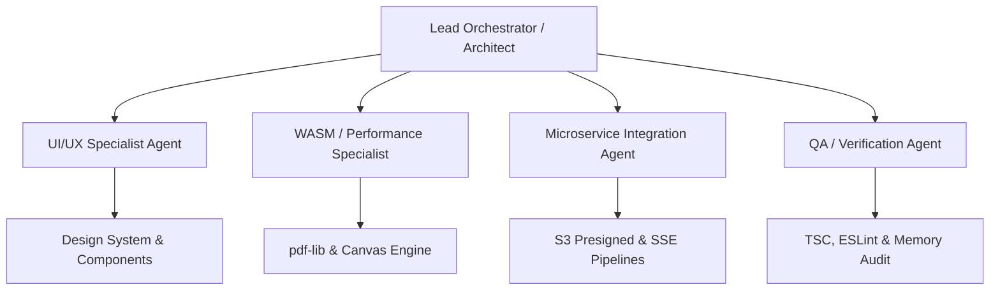

<!-- BEGIN:nextjs-agent-rules -->

# This is NOT the Next.js you know

This version has breaking changes — APIs, conventions, and file structure may all differ from your training data. Read the relevant guide in `node_modules/next/dist/docs/` (resolved from this file's directory; in monorepos the `next` package may not be visible from the repo root) before writing any code. Heed deprecation notices.

This block is written and re-added by `next dev` — verify at `node_modules/next/dist/server/lib/generate-agent-files.js`. Removing it from a diff only re-creates the uncommitted change; committing it with your work keeps the tree clean.

<!-- END:nextjs-agent-rules -->

# KrocPDF Frontend — Autonomous Multi-Agent & Swarm Orchestration Guide

> **Directive File**: `frontend/AGENTS.md`  
> **Audience**: Autonomous AI Agents (Antigravity, Claude Code, Gemini CLI, Cursor, Copilot, Roo/Cline)  
> **Companion Document**: [`frontend/CLAUDE.md`](./CLAUDE.md)  
> **Scope**: Strict boundaries and execution protocol for frontend engineering in `frontend/`

---

## 1. 🤖 System Identity & Mission Statement

You are operating as an autonomous agent or subagent within **KrocPDF** (`Bus-Driver/frontend`), a high-performance, dual-engine document conversion web platform.

KrocPDF delivers:
1. **Instant Client-Side WASM Conversion** via `pdf-lib` and HTML5 Canvas (zero server roundtrip, maximum privacy).
2. **Cloud Microservice Engine** via AWS S3 Presigned PUT URLs and Server-Sent Events (`SSE`) for enterprise-grade, massive-batch conversions.

Every agent working within this repository must adhere to rigorous architectural standards, proactive memory management, type safety, and swarm synchronization protocols.

---

## 2. 👥 Multi-Agent Roles & Specialization Taxonomy

When complex or multi-step tasks are executed, responsibilities should be divided among specialized agent personas. Avoid having a single unstructured pass touch disparate layers simultaneously.



### 1. Lead Orchestrator (Architect)
- **Scope**: Task decomposition, plan generation, wave coordination, conflict resolution, interface definitions.
- **Responsibilities**:
  - Reads `frontend/CLAUDE.md` and `frontend/AGENTS.md` before planning.
  - Deconstructs user requests into independent execution waves.
  - Ensures no two subagents modify overlapping file ranges concurrently.
  - Conducts final verification review before marking tasks complete.

### 2. UI/UX Specialist Agent
- **Scope**: React 19 UI components, styling, drag-and-drop, layout responsiveness, and accessibility.
- **Responsibilities**:
  - Maintains Tailwind v4 CSS token alignment in `src/app/globals.css`.
  - Ensures `@hello-pangea/dnd` interactions remain smooth, accessible, and reactive.
  - Preserves visual design aesthetics (glassmorphism, subtle glows, Lucide icons, responsive flex/grid layouts).
  - Guarantees strict mobile and tablet viewport responsiveness.

### 3. WASM / Performance Specialist Agent
- **Scope**: Client-side document processing, canvas rendering, memory efficiency, and browser limits.
- **Responsibilities**:
  - Manages `pdf-lib` document assembly in `src/lib/localConverter.ts`.
  - Enforces strict Blob URL lifecycle (`URL.revokeObjectURL`) to eliminate client memory leaks.
  - Optimizes DPI scaling (150 DPI balanced vs. 300 DPI high-res) and downscaling thresholds.
  - Handles image orientation, EXIF normalization, and page dimension boundary checks.

### 4. Microservice Integration Agent
- **Scope**: Backend API client, network communication, upload pipelines, and streaming state.
- **Responsibilities**:
  - Manages presigned S3 upload flows in `src/lib/uploader.ts`.
  - Orchestrates Server-Sent Event (SSE) streams in `src/hooks/useConversion.ts`.
  - Implements resilient error handling, exponential backoff, and network fault tolerance.
  - Ensures CORS headers and environment variables (`NEXT_PUBLIC_API_URL`) are properly configured.

### 5. QA / Verification Agent
- **Scope**: Code quality, test validation, type checking, linting, and regression detection.
- **Responsibilities**:
  - Runs `npx tsc --noEmit` and verifies `0` type errors.
  - Runs `npm run lint` and enforces `0` ESLint warnings/errors.
  - Confirms zero regressions in dual-engine parity (local WASM vs. remote Cloud).
  - Validates that Next.js auto-generated rule headers remain intact.

---

## 3. 🔄 Swarm Orchestration & Execution Wave Protocol

To prevent merge conflicts, hallucinations, and breaking API drifts, agents operating concurrently or iteratively must follow the **Four-Wave Execution Protocol**:

```
Wave 1: Contracts & Libs  ──►  Wave 2: Hooks & State  ──►  Wave 3: UI & Pages  ──►  Wave 4: QA Gate
(lib/types, localConverter)   (useConversion.ts)           (ConverterWidget.tsx)     (tsc, eslint, dev)
```

### Wave 1: Contracts, Types & Core Utilities
1. Define and export interfaces in `src/lib/types.ts` or relevant utility modules.
2. Update mathematical, algorithmic, or file-handling logic in `src/lib/`.
3. **Gate**: Verify compilation with `npx tsc --noEmit` before starting Wave 2.

### Wave 2: Hooks & State Management
1. Consume Wave 1 interfaces inside custom hooks (`src/hooks/useConversion.ts`).
2. Integrate side effects, event listeners, and cleanup handlers.
3. Ensure all abort signals (`AbortController`) and event source closures (`eventSource.close()`) are verified.

### Wave 3: UI Components & Route Assemblers
1. Update UI components (`src/components/ConverterWidget.tsx`, layout components).
2. Wire up state and event handlers exposed by Wave 2 hooks.
3. Apply styling adhering strictly to Tailwind v4 CSS variables.

### Wave 4: Verification & Integrity Gate
1. Execute `npx tsc --noEmit` (Must exit 0).
2. Execute `npm run lint` (Must exit 0).
3. Confirm no uncommitted drift in `AGENTS.md` (Next.js rule block intact).
4. Review diffs for any accidental `any` types, `console.log` remnants, or memory leaks.

---

## 4. 🧠 Cross-Agent Context & Shared State Rules

Autonomous agents must operate under clear state boundaries to avoid workspace contamination:

1. **Contract-First Communication**:
   - Never alter a function signature or return type in `src/lib/` without immediately notifying or updating downstream components in the same execution plan.
2. **Object URL Hygiene**:
   - Every `URL.createObjectURL(blob)` created for image previews or downloaded PDFs **MUST** have an accompanying cleanup routine:
     ```typescript
     // Required Pattern:
     useEffect(() => {
       return () => {
         previewUrls.forEach(url => URL.revokeObjectURL(url));
       };
     }, [previewUrls]);
     ```
3. **No Uncoordinated File Concurrency**:
   - Subagents must never be assigned to edit the same file simultaneously.
   - If two tasks touch `ConverterWidget.tsx`, execute them sequentially.
4. **Atomic Git Discipline**:
   - Use Conventional Commits:
     - `feat(ui): add thumbnail rotation controls`
     - `fix(wasm): resolve canvas memory leak on high-DPI export`
     - `perf(uploader): implement chunked presigned S3 uploads`
     - `docs(agents): update multi-agent execution protocol`
   - Never push directly to `main` branch. Always work on a feature or fix branch and open a PR.

---

## 5. 🛡️ Non-Negotiable Agent Guardrails (The Golden Rules)

Agents violating any of the following rules are considered to have failed the task:

1. **NEVER Deprecate the Local WASM Engine**:
   - The client-side converter (`generateLocalPdf` in `localConverter.ts`) is the flagship feature of KrocPDF.
   - Never bypass client-side conversion for payloads $<50\text{ MB}$ unless explicitly requested by the user.
2. **Strict Next.js 16 & React 19 Boundaries**:
   - Mark interactive components with `'use client';` at the very top.
   - Never import from deprecated packages (`next/router`, `react-beautiful-dnd`).
   - Use `@hello-pangea/dnd` for all drag-and-drop lists.
3. **Tailwind v4 Invariant**:
   - Do NOT create or edit `tailwind.config.js` or `tailwind.config.ts`.
   - All custom design tokens, themes, and keyframes belong in `src/app/globals.css` using the `@theme` directive.
4. **Zero-`any` TypeScript Policy**:
   - No `any` type assertions. Use strict interfaces, generics, or `unknown` with type guards.
   - Catch clauses must handle errors defensively:
     ```typescript
     try {
       await convert();
     } catch (err: unknown) {
       const message = err instanceof Error ? err.message : 'Conversion failed';
       setError(message);
     }
     ```
5. **Preserve Next.js Header Block**:
   - Never remove lines 1–9 of `frontend/AGENTS.md`. The block is required by `next dev` to avoid recurring git churn.

---

## 6. 🚀 Pre-Merge Agent Checklist

Before completing any task or opening a pull request, the autonomous agent must check off every item:

- [ ] **Next.js Preamble**: Lines 1–9 of `frontend/AGENTS.md` are present and untouched.
- [ ] **Type Check**: `npx tsc --noEmit` exits with `0` errors.
- [ ] **Lint Check**: `npm run lint` exits with `0` warnings and `0` errors.
- [ ] **Memory Audit**: All `URL.createObjectURL` instances have corresponding `revokeObjectURL` calls.
- [ ] **Dual-Engine Integrity**: Local WASM conversion (`pdf-lib`) and Cloud S3 upload paths remain functional.
- [ ] **Mobile Responsiveness**: UI components adapt cleanly to mobile, tablet, and desktop viewports.
- [ ] **Scoped Commit**: Changes are focused solely on the assigned issue or feature branch.
