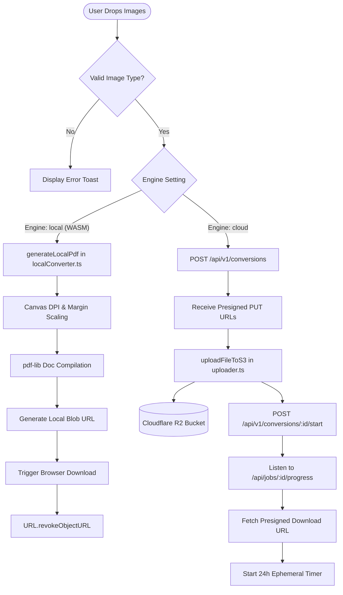

<!-- BEGIN:nextjs-agent-rules -->

# This is NOT the Next.js you know

This version has breaking changes — APIs, conventions, and file structure may all differ from your training data. Read the relevant guide in `node_modules/next/dist/docs/` (resolved from this file's directory; in monorepos the `next` package may not be visible from the repo root) before writing any code. Heed deprecation notices.

This block is written and re-added by `next dev` — verify at `node_modules/next/dist/server/lib/generate-agent-files.js`. Removing it from a diff only re-creates the uncommitted change; committing it with your work keeps the tree clean.

<!-- END:nextjs-agent-rules -->

# 🐊 KrocPDF — Frontend Client Architecture & AI Agent Guide (`CLAUDE.md`)

> **Directive for Claude Code & AI Collaborators:** This document is your canonical knowledge base and operating directive when working in `/frontend`. Read this completely before writing code. Enforce all guardrails, component contracts, and Next.js 16 / Tailwind v4 invariants.

---

## 📑 Quick Navigation
- [1. Mission & System Identity](#1-mission--system-identity)
- [2. Component & Directory Topology](#2-component--directory-topology)
- [3. Technology Stack & Invariants](#3-technology-stack--invariants)
- [4. Dual-Engine Workflow (WASM vs Cloud)](#4-dual-engine-workflow-wasm-vs-cloud)
- [5. Non-Negotiable Agent Guardrails](#5-non-negotiable-agent-guardrails)
- [6. Development & Verification Commands](#6-development--verification-commands)
- [7. External API & Microservice Contracts](#7-external-api--microservice-contracts)

---

## 1. Mission & System Identity

**KrocPDF** is an open-source, privacy-first alternative to predatory PDF utilities (e.g., iLovePDF, Smallpdf).
- **Core Value Proposition:** 100 MB free file limit, zero watermarks, zero display ads, lossless 150/300 DPI exports.
- **Dual Conversion Engine:**
  1. **Local Privacy Mode (WASM):** Client-side compilation via `pdf-lib` + Canvas. Zero bytes traverse the network.
  2. **Distributed Cloud Mode:** Large batches (>50MB or >20 images) orchestrated via NestJS, streamed directly to Cloudflare R2 presigned URLs, and processed by a Go worker daemon with SSE progress feedback.

---

## 2. Component & Directory Topology

```
frontend/
├── public/
│   ├── brand/
│   │   ├── logo.png                # Transparent KrocPDF primary logo
│   │   ├── logo-without-bg.png     # Transparent logo asset
│   │   └── logo-with-bg.png        # Black-background logo asset
│   └── favicon.ico
├── src/
│   ├── app/
│   │   ├── globals.css             # Tailwind v4 theme & glassmorphic utility styles
│   │   ├── layout.tsx              # Root HTML wrapper, Geist font setup, metadata
│   │   └── page.tsx                # Main conversion portal hosting <ConverterWidget />
│   ├── components/
│   │   ├── ConverterWidget.tsx     # Central stateful engine: drag-drop, settings, upload & WASM trigger
│   │   └── PrivacyTimer.tsx        # Ephemeral 24h retention countdown timer & instant delete action
│   ├── hooks/
│   │   └── useConversion.ts        # SSE streaming hook, job state machine, progress tracking
│   └── lib/
│       ├── api.ts                  # API_BASE_URL resolver (NEXT_PUBLIC_API_URL fallback)
│       ├── localConverter.ts       # Client-side pdf-lib + HTML Canvas WASM generator
│       ├── seoConfigs.ts           # Dynamic metadata definitions & SEO schema maps
│       └── uploader.ts             # Direct XMLHttpRequest presigned PUT dispatcher to S3/R2
├── package.json
├── tsconfig.json
├── eslint.config.mjs               # ESLint 9 flat config
└── postcss.config.mjs              # PostCSS 4 bridge for Tailwind v4
```

---

## 3. Technology Stack & Invariants

| Layer | Library / Version | Invariant / Critical Note |
|:---|:---|:---|
| **Framework** | Next.js `16.3.4` (App Router) | React `19.2.8`. Breaking changes from Next 14/15. |
| **Styling** | Tailwind CSS `^4.0` | Uses `@tailwindcss/postcss`. Do NOT create a legacy `tailwind.config.js`. |
| **Drag & Drop** | `@hello-pangea/dnd` `18.0.1` | Accessible, React 19-compatible fork of react-beautiful-dnd. |
| **Client PDF Engine**| `pdf-lib` `1.17.1` | Native WebAssembly-adjacent array buffer manipulation. |
| **Icons** | `lucide-react` | Tree-shakeable SVG icons. |

---

## 4. Dual-Engine Workflow (WASM vs Cloud)



---

## 5. Non-Negotiable Agent Guardrails

When modifying or expanding the `frontend` codebase, Claude Code and all agents MUST obey these rules:

1. **Memory & Object URL Disposal:**
   - Always revoke object URLs (`URL.revokeObjectURL`) when previews or downloads complete.
   - Never retain raw image base64 strings in long-lived state. Use ephemeral `File` references or Blob URLs.
2. **Next.js 16 & React 19 Client Boundaries:**
   - Any component utilizing hooks (`useState`, `useCallback`, `useEffect`), drag-and-drop, or browser APIs must have `'use client';` as line 1.
   - Do not use deprecated `next/font` imports or obsolete router hooks (`next/router` is forbidden; use `next/navigation`).
3. **Tailwind CSS v4 Conventions:**
   - Do NOT introduce a `tailwind.config.js` or `@apply` chains that conflict with Tailwind v4.
   - All custom design tokens belong in `src/app/globals.css` using the `@theme` directive.
4. **TypeScript & Type Safety:**
   - Strict mode is enabled. Never use `any`. Explicitly type all payloads and callback signatures.
   - Handle catch blocks with `err: unknown` and verify with `err instanceof Error`.
5. **Preserve Dual-Engine Parity:**
   - Never remove or deprecate the local WASM mode (`localConverter.ts`). It is our primary differentiator.
   - Mobile safeguard: If total local payload exceeds $50\text{ MB}$ or $20$ files, prompt user to switch to Cloud Engine to prevent mobile browser tab crashes.

---

## 6. Development & Verification Commands

All commands should be executed from the `frontend/` directory:

```bash
# Start development server (runs on http://localhost:3000 or 3001)
npm run dev

# Typecheck entire codebase (Zero error tolerance)
npx tsc --noEmit

# Run ESLint validation
npm run lint

# Dry-run production build
npm run build
```

---

## 7. External API & Microservice Contracts

When running Cloud Mode, the frontend communicates with the NestJS API gateway (`NEXT_PUBLIC_API_URL`, default `http://localhost:3000`):

### 1. Initiate Conversion Job
- **Endpoint:** `POST /api/v1/conversions`
- **Payload:**
  ```json
  {
    "pageSize": "A4",
    "orientation": "PORTRAIT",
    "margins": "NONE",
    "dpi": 150,
    "images": [
      { "sequenceOrder": 0, "fileName": "page1.jpg", "mimeType": "image/jpeg", "sizeBytes": 1048576 }
    ]
  }
  ```
- **Response:** `{ "jobId": "uuid", "uploadTargets": [{ "sequenceOrder": 0, "presignedPutUrl": "https://..." }] }`

### 2. Direct Binary S3/R2 Upload
- **Method:** `PUT <presignedPutUrl>`
- **Header:** `Content-Type: ` (Strict match)
- **Body:** Raw file binary buffer

### 3. Real-Time Conversion SSE Stream
- **Endpoint:** `GET /api/jobs/:jobId/progress`
- **Events:**
  - `progress`: `{ "stage": "CONVERTING", "percent": 75, "message": "Compiling PDF..." }`
  - `complete`: `{ "stage": "COMPLETED", "percent": 100, "downloadUrl": "https://..." }`
  - `error`: `{ "stage": "FAILED", "error": "Reason" }`

### 4. Instant Ephemeral Purge
- **Endpoint:** `DELETE /api/jobs/:jobId`
- **Action:** Immediately removes source images and compiled output from Cloudflare R2 bucket.
